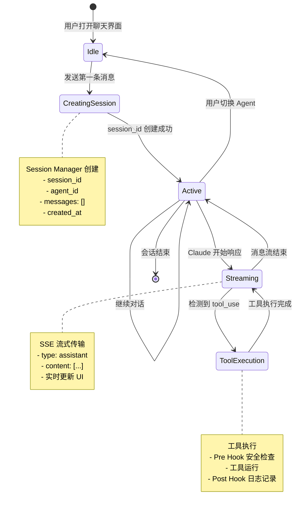

# AI Agent Platform - 流程图文档

本文档包含系统主要流程的 Mermaid 图表。

## 1. 整体系统架构流程


## 2. 聊天会话流程（核心流程）


## 3. Agent 配置与初始化流程


## 4. 工具调用与 Hook 流程


## 5. Skills 上传与使用流程


## 6. MCP Server 集成流程


## 7. 会话状态管理流程



## 8. 错误处理流程


## 9. 前端状态管理流程


## 10. 部署架构流程（生产环境）


---

## 图表说明

### 图表 1: 整体系统架构
展示了前端、后端、数据层和外部服务之间的关系。

### 图表 2: 聊天会话流程（核心）
最重要的流程，展示了从用户输入到 Claude 响应的完整数据流。

### 图表 3: Agent 配置流程
展示了如何创建和配置一个 Agent，包括工具、Skills 和 MCP 的集成。

### 图表 4: 工具调用流程
展示了 Claude 调用工具时的 Hook 机制和安全检查。

### 图表 5: Skills 流程
展示了 Skills 的上传、存储和使用流程。

### 图表 6: MCP Server 集成
展示了三种 MCP 连接类型（stdio/sse/http）的配置和使用。

### 图表 7: 会话状态管理
使用状态图展示会话的生命周期。

### 图表 8: 错误处理
展示了各种错误情况的处理逻辑。

### 图表 9: 前端状态管理
展示了 TanStack Query 和 SSE 流式响应的状态管理。

### 图表 10: 生产部署架构
展示了 AWS 生产环境的部署架构。

---

## 使用说明

1. **在 Markdown 编辑器中查看**: 支持 Mermaid 的编辑器（如 VS Code + Mermaid 插件、Typora、GitHub）可以直接渲染这些图表。

2. **在线渲染**: 访问 [Mermaid Live Editor](https://mermaid.live/) 粘贴代码查看。

3. **导出图片**: 使用 Mermaid CLI 或在线工具导出 PNG/SVG 格式。

```bash
# 使用 Mermaid CLI 导出
npm install -g @mermaid-js/mermaid-cli
mmdc -i FLOWCHARTS.md -o flowcharts.pdf
```
