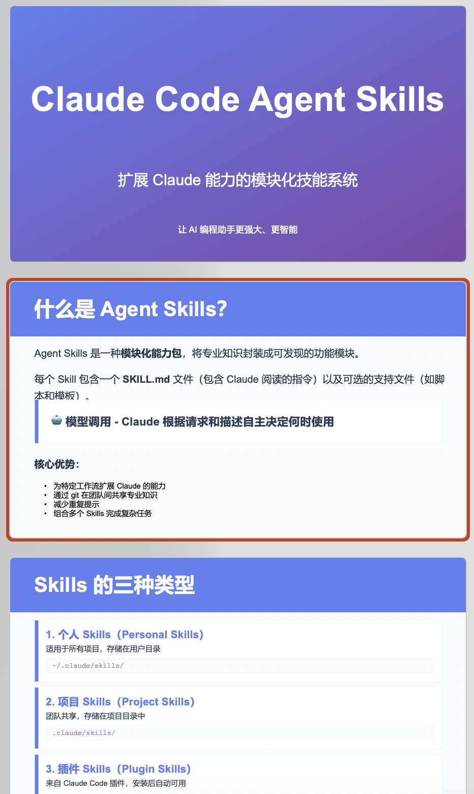
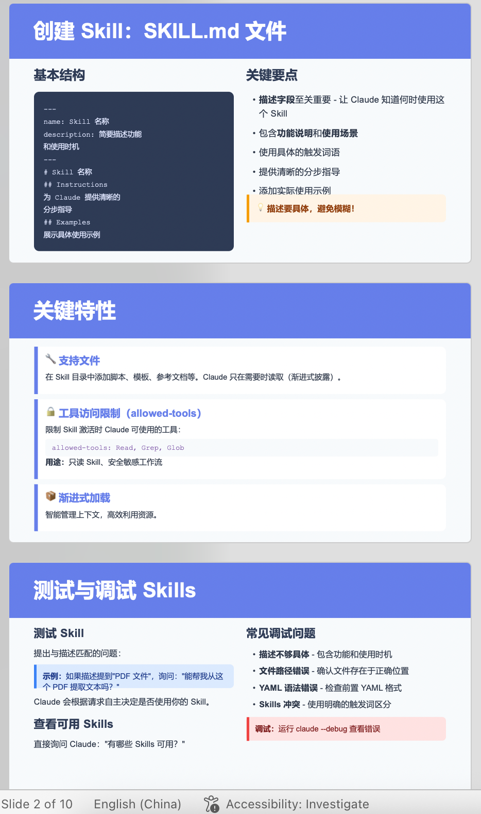

# Strands Agents SDK 如何使用 [Claude SKILLs](https://github.com/anthropics/skills)

## 环境要求
1. Python >=3.12
2. uv https://docs.astral.sh/uv/getting-started/installation/
3. nodejs https://nodejs.org/en/download

## 环境安装
- python运行环境
```bash
uv sync
source .venv/bin/activate
```

- 可以预先安装一些nodejs依赖包提高效率 (如果不提前安装，Agent也会在执行过程中调用shell工具自行安装)
```bash
npm install
```

### 添加Tavily API（可选）
- 创建环境变量
```bash
echo "TAVILY_API_KEY=<api-key>" >>.env
```

## 效果测试
1. 生成PPT
```bash
python main.py --prompt "research about Claude Code Agent Skills (https://docs.claude.com/en/docs/claude-code/skills), and create a ppt in Chinese to introduce it, save it as pptx file in working directory."
```

2. 效果预览
**生成PPT文件下载 [Claude-Code-Agent-Skills-介绍.pptx](assets/Claude-Code-Agent-Skills-介绍.pptx)**

