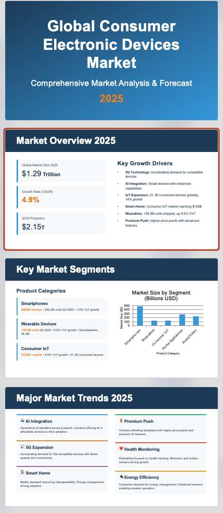

# How Strands Agents SDK Uses [Claude SKILLs](https://github.com/anthropics/skills)

## Technical Article Link

https://mp.weixin.qq.com/s/oE2S0jMWyFjkYL4ZZvmamQ
- 

## Update Log
2025.10.31 Added [SKILL MCP Server](../skills-mcp-server/README.md) usage instructions:

First start the MCP Server, then return to this directory and run the following commands to temporarily replace with the forked version of Strands Agents SDK (which needs to support MCP Resource Operations)
```bash
deactivate
uv sync
uv pip install git+https://github.com/xiehust/sdk-python.git@c257c9238b1fa81b12b598855b0b1ae3e95a6e11
```

- Run the following code:
```bash
python agent_with_mcp.py --prompt "research about Claude Code Agent Skills (https://docs.claude.com/en/docs/claude-code/skills), and create a ppt in Chinese to introduce it, save it as pptx file in working directory."
```


## Environment Requirements
1. Python >=3.12
2. uv https://docs.astral.sh/uv/getting-started/installation/
3. nodejs https://nodejs.org/en/download

## Environment Installation
- Python runtime environment
```bash
uv sync
source .venv/bin/activate
```

- You can pre-install some Node.js dependencies to improve efficiency (if not installed in advance, the Agent will automatically install them by calling shell tools during execution)
```bash
npm install
```

### Add Tavily API ([Click to register for free](https://docs.tavily.com/documentation/mcp))
- Create environment variable
```bash
echo "TAVILY_API_KEY=<api-key>" >>.env
```


## Effect Testing (1)
1. Generate PPT
```bash
python main.py --prompt "research about Claude Code Agent Skills (https://docs.claude.com/en/docs/claude-code/skills), and create a ppt in Chinese to introduce it, save it as pptx file in working directory."
```

2. Effect Preview
**Download Generated PPT Files**
1. [Claude-Code-Agent-Skills-介绍.pptx](assets/Claude-Code-Agent-Skills-介绍.pptx)

2. [Global_Consumer_Electronics_Market_2025_by_strands.pptx](assets/Global_Consumer_Electronics_Market_2025_by_strands.pptx)


